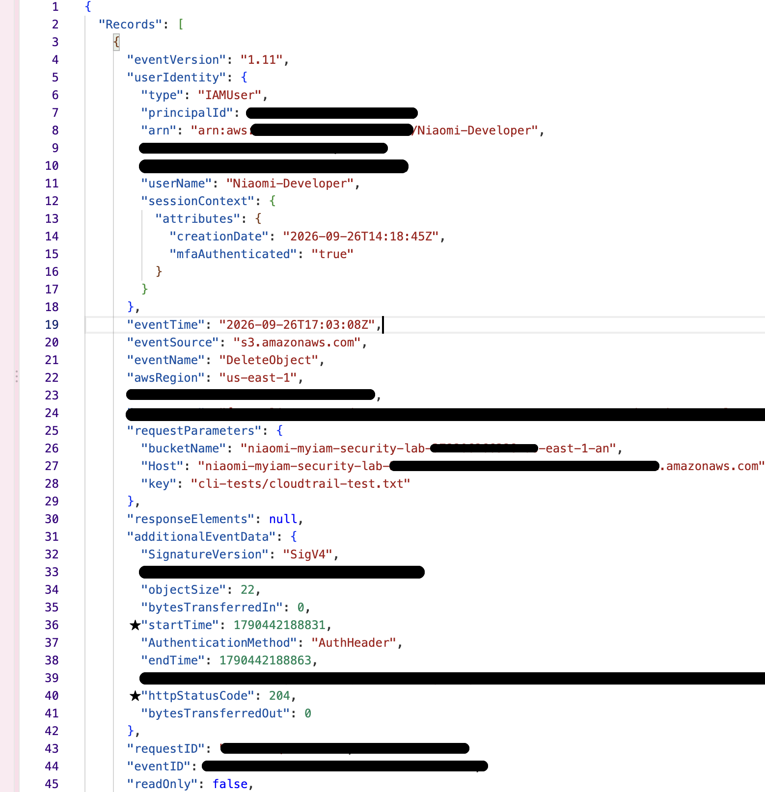
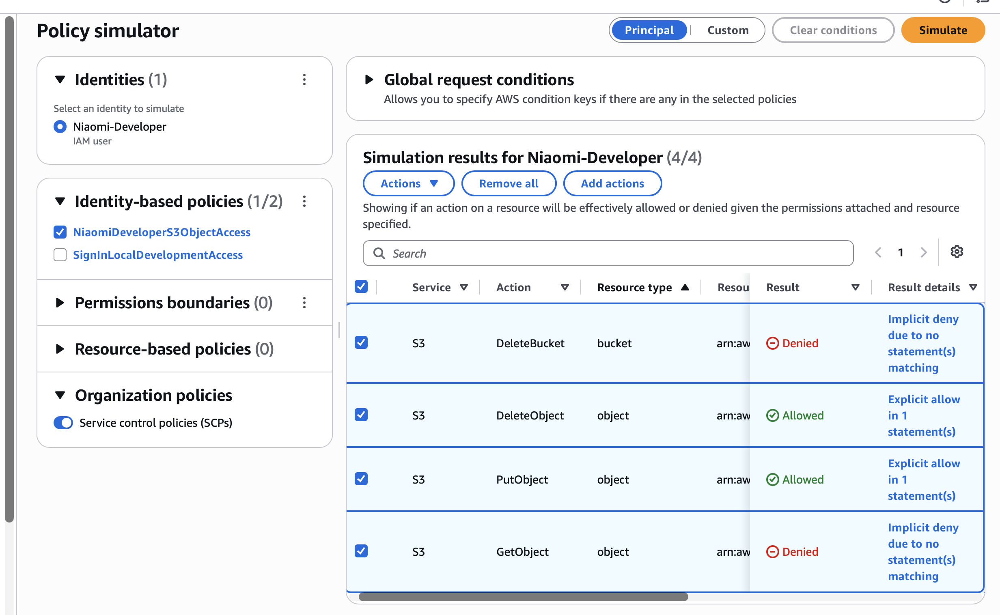

# AWS IAM Least-Privilege Security Lab ☁️

A hands-on AWS security lab focused on IAM authorization, least-privilege access, permission validation, and CloudTrail auditing.

This project simulates a developer access scenario in AWS and demonstrates how narrowly scoped S3 permissions can be designed, tested, and audited using IAM Policy Simulator, AWS CLI, and CloudTrail data events.

## Project Overview

The goal of this lab was to create a controlled AWS environment where a developer identity could perform only the S3 operations required for a simulated workflow.

☼ The project included:

- Creating and configuring an isolated S3 security lab environment.
- Creating an IAM developer identity and group.
- Designing a customer-managed least-privilege S3 policy.
- Testing allowed and denied actions with IAM Policy Simulator.
- Validating permissions through AWS CLI API requests.
- Configuring CloudTrail S3 data events for object-level activity.
- Investigating successful and denied S3 requests through CloudTrail logs.
- Documenting the security findings and supporting evidence.

## Technical Environment

- **Cloud Platform:** AWS
- **Region:** us-east-1 (N. Virginia)
- **Identity & Access:** AWS IAM
- **Storage:** Amazon S3
- **Auditing:** AWS CloudTrail
- **Testing:** IAM Policy Simulator, AWS CLI
- **Authentication:** AWS CLI `aws login` with temporary credentials
- **Development Environment:** macOS, Zsh, VS Code

## Security Controls

☼ The lab used the following security controls:

- IAM group-based permission management.
- Customer-managed IAM policy with narrowly scoped S3 object permissions.
- S3 Block Public Access enabled.
- S3 bucket-owner-enforced object ownership.
- S3 server-side encryption using SSE-S3.
- MFA enabled for IAM identities used for interactive console access.
- CloudTrail data events configured for selected S3 object-level API activity.
- No long-lived AWS access keys were used for CLI testing.

## Testing & Results

☼ The developer identity was tested using both the IAM Policy Simulator and AWS CLI requests.

| S3 Action | Policy Simulator | AWS CLI Test |
| --- | --- | --- |
| `s3:PutObject` | Allowed | Successful |
| `s3:DeleteObject` | Allowed | Successful |
| `s3:GetObject` | Denied | `AccessDenied` |
| `s3:DeleteBucket` | Denied | `AccessDenied` |

The results matched the permissions defined in the IAM policy. The developer could upload and delete objects within the designated bucket but could not retrieve objects or delete the bucket itself.

CloudTrail data events were then used to verify the S3 activity and capture the identity, requested action, target resource, request status, and other audit information associated with the API requests.

## Assessment

☼ A detailed security assessment documents the intentionally over-permissioned baseline, least-privilege policy design, permission validation, CloudTrail investigation, and final security findings.

[View the Security Assessment](findings/security-assessment.md)

## Evidence

Supporting screenshots are included in the `screenshots/` directory.

### CloudTrail Evidence

#### PutObject event - Successful

#### GetObject event with `AccessDenied`

#### DeleteObject event - Successful

### IAM Policy

☼ The developer IAM policy grants only `s3:PutObject` and `s3:DeleteObject` access to objects within the designated S3 bucket.

### IAM Policy Simulator

☼ The Policy Simulator confirmed that the intended S3 object actions were allowed while unauthorized actions were denied.

## Key Findings

☼ The assessment confirmed that the `Niaomi-Developer` IAM identity had narrowly scoped S3 object permissions.

The policy allowed:

- `s3:PutObject`
- `s3:DeleteObject`

The following actions were denied:

- `s3:GetObject`
- `s3:DeleteBucket`

IAM Policy Simulator and AWS CLI testing produced matching results, confirming that the implemented policy behaved as intended.

CloudTrail data events provided audit evidence for the S3 API activity generated during testing, including successful and denied requests.

☼ The final configuration demonstrated least-privilege access by limiting the developer identity to the S3 operations required for the simulated workflow.

## Security & Privacy

☼ This project was performed in a personal AWS lab environment for educational and portfolio purposes.

☼ Screenshots containing sensitive AWS metadata were sanitized before being included in the repository. No long-lived AWS access keys, production credentials, or real company data were used.
